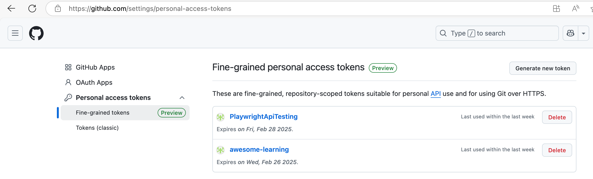
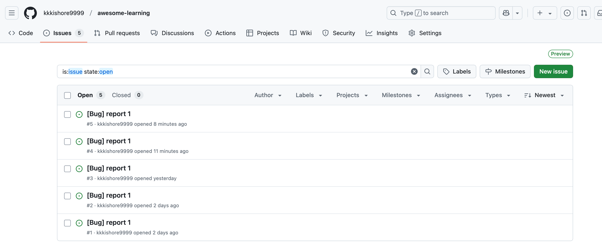

# PlaywrightApiTesting
API token are not push for this branch make sure create it in GITHUB.com website for reuse of this package.DEBUG=pw:api npx playwright test src/example.test.ts
Use this key to set token for access remote repo i.e. API_TOKEN=

Output generated by running package and also test.ts using below statement
npx playwright test src/example.test.ts
